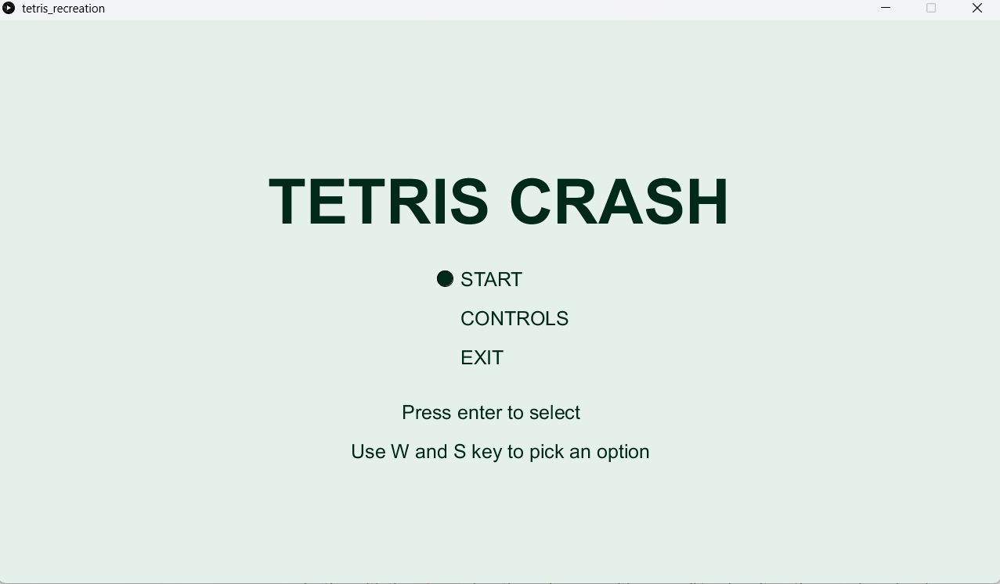
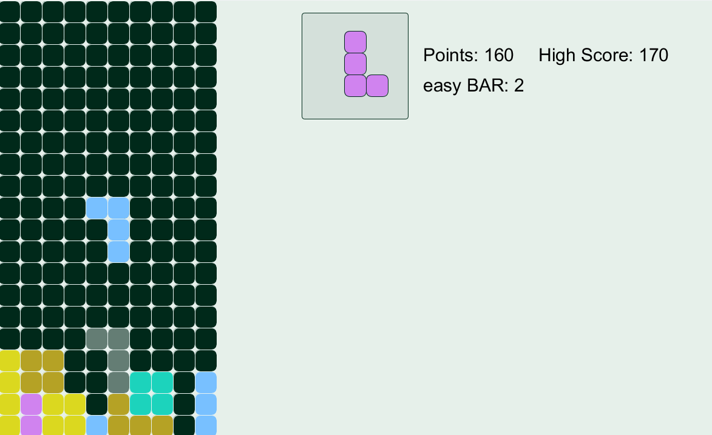
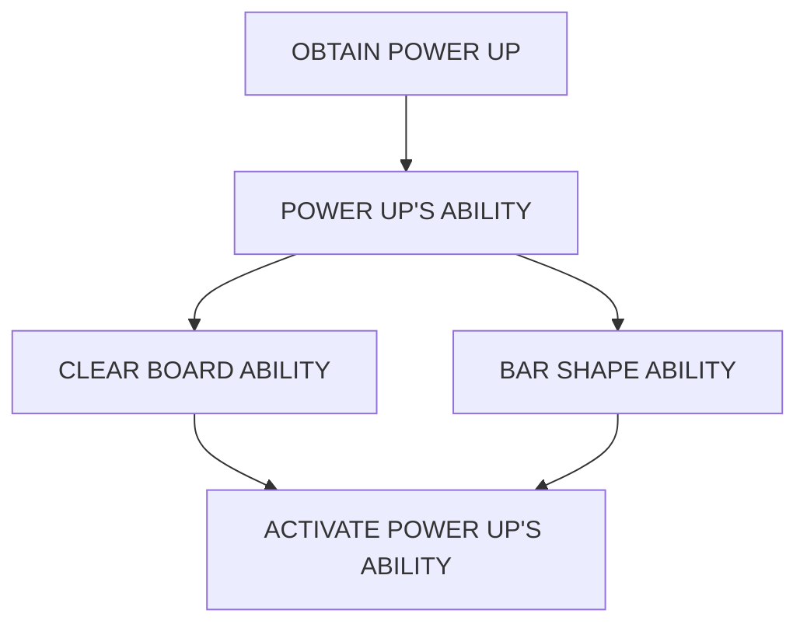
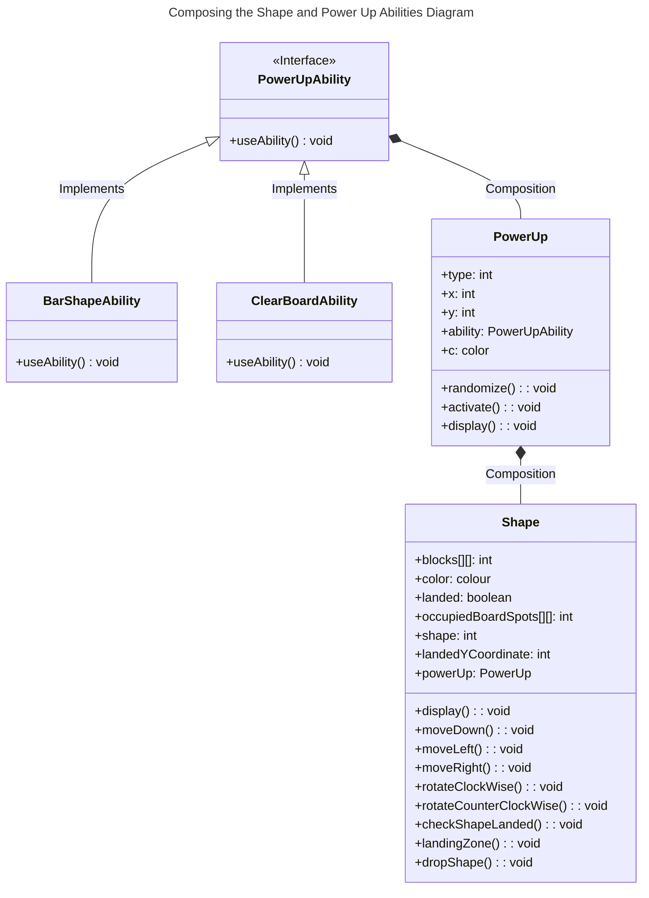
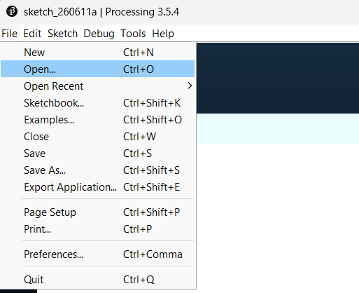
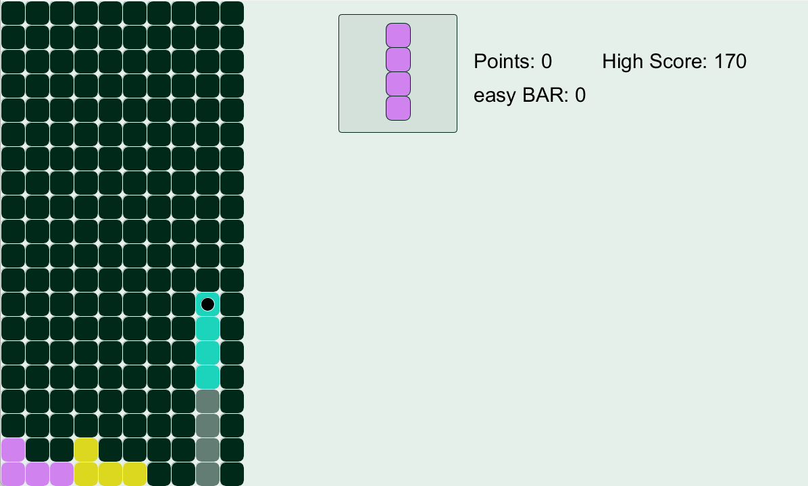
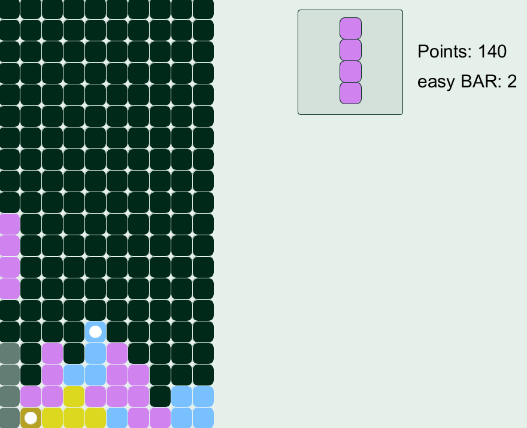

# Tetris Recreation

|                                                                                   |                                                                                 |
| --------------------------------------------------------------------------------- | ------------------------------------------------------------------------------- |
|  |  |

 

## Table of Contents

- [About](#about)
- [Features Implemented](#features-implemented)
    - [Landing Zone](#landing-zone)
    - [Power Up System](#power-up-system)
- [Designing the Landing Zone Code](#designing-the-landing-zone-code)
- [Designing the Power Up Abilities](#designing-the-power-up-abilities)
- [Composition of the Shape and Power Up Abilities](#composition-of-the-shape-and-power-up-abilities)
- [How to Install and Run the Game](#how-to-install-and-run-the-game)
- [Gameplay](#gameplay)
    - [Gameplay Loop](#gameplay-loop)
    - [Additional Features](#additional-features)
- [Controls](#controls)
    - [Gameplay Controls](#gameplay-controls)
    - [Main Menu Controls](#main-menu-controls)

## About

A recreation of the classic block stacking game, where I approached it using an object oriented approach such as using interfaces and polymorphism to create the powerup system. The main purpose of this project was to practice and apply my code designing and architecting skills.

## Features Implemented

### Landing Zone

while controlling a shape the potential location of where it can land on the game board appears as a semi transparent version matching the current shape’s orientation.

### Power Up System

A power up system has been implemented in where a power up has the chance to randomly spawn in, as part of a shape’s block. To activate the power up an entire row in the gameboard containing the block with the power in it has to be cleared. The ability of the power ups range from clearing the entire game board to being able to swap the current shape with a straight bar shape with limited usage.

## Designing the Landing Zone Code

Implementing this feature involved recreating the code that checks if the current shape has landed at the bottom of the game board or on top of placed blocks. It involved using a separate array that will track a second copy of the current shape and the position of it’s block and having it act as if it fell all the way down to indicate where it would land.

The purpose of implementing this feature is to increase the player’s user experience by allowing them to easily plan where to stack and drop shapes and gain the highest score possible in the game.

The following logic was implemented to create this feature:

```
landingZoneBlocks = currentShapeBlocks
landingZoneFound = false
while landingZoneFound is false:
    for each block in landingZoneBlocks:
        block.y increase by 1
    for each block in landingZoneblocks:
        if block.y > bottom of game board or (block.y + 1 == occupiedBoardspots.y and block.x == occupiedBoardspots.x):
            landingZoneFound = true
            break


```

## Designing the Power Up Abilities

To ensure different the different powerup abilities will be activated when a row containing them is cleared, interfaces were implemented to allow for code flexibility through polymorphism. By doing it this way it allows the correct logic to trigger based on the power up ability.



To achieve this effect and ensure the code would be clean, extensible and loosely decoupled the ability type to execute, interfaces were implemented in the code’s design. A base power class was created to house all the core information a power up required: ability, location, activating it, etc. Below is the psuedo code on how it was implemented in.

Power Up class

```
class Powerup:
    type: integer
    x: integer
    y: integer
    ablity: PowerUpAbility
    Constructor(x:integer, y:integer):
        this.x = x
        this.y = y
        randomize()

    Method randomize():
        type = randomInteger(0, 2)
        if type == 0:
            ablity = new ClearBoardAbility();
        else:
            ablilty = new BarShapeAbility();

    Method activate():
        ability.useAbility()

    Method display():
        //some code to display it as a circle at it's given x,y coordinates and size of 20
        circleShape(x, y, 20)
```

Power Up Ability Inteface

```
inteface PowerUPAbility:
    Method useAbility()
```

Abilities implementing the Interface

```
// gridSpotColour and occupiedGridSpot are global variables that refer
// the current state of the gameboard
class ClearBoardAbility implements PowerUpAbility:
    Method useAbility():
        for each x coordinate in the gameboard's width:
            for each y coordiante in the gameboard's height:
                gridSpotColour[x][y] = reset to default colour
                occupiedGridSpot[x][y] = false
```

```
// easyBarUsage is a global variable that refers to the number of usage for this ability
class BarShapeAbility implements PowerUpAbility:
    Method useAbility():
        easyBarUsage += 1
```

## Composition of the Shape and Power Up Abilities

Both the `BarShapeAbility` and `ClearBoardAbility` implement the `PowerUpAblity` interface in which the `PowerUp` class will use through composition. The `PowerUp` class is then used in conjuction with the `Shape` class through composition as well to place it on the gameboard and activate it.

Diagram on the composition of the Power Up Abilities and the Shape class



## How to Install and Run the Game

1. Clone the repository by using the GitHub CLI with the following command:

    ```
    gh repo clone ThomasNLy/tetris_recreation
    ```

    or download the zip file by clicking the **Code** button in the repository web page, then clicking the **Download Zip** option.
    - If downloading it as a zip, ensure the files are extracted before proceeding to the next steps

2. Install the processing IDE on your machine from the [processing.org](http://processing.org) website and follow the setup instructions for it (this project is compatible with Processing Version 3.5.4 and onwards).
    - Processing IDE [Link to download](https://processing.org/download)
3. Open up and start the Processing IDE and select file and open from the menu options in the app. From there navigate to the project’s file location and select tetris_recreation.pde than click the **Open** button to open it.

    

    

4. Press the run button in the Processing IDE to run the code and play the game.

    

## Gameplay Loop

Just like the classic game of Tetris stack shapes in the gameboard and fill up a full row to clear it and gain points. Avoid stacking shapes to the top of the gameboard as it will result in an immediate game over.

### Additional Features

Power ups can randomly spawn in, on one of the blocks of a shape. To activate the power up, the shape containing it has to be placed on the gameboard and the row containing it has to be cleared.

**Shape with a power up**



**Clearing a row to obtain a power up**



The predicted landing zone is an additional feature added in, where it’ll show where the shape will land. It appears as a semi transparent greyed out version of the current shape matching the current orientation.

## Controls

### Gameplay Controls

Use the A and D keys to move the current shape either left or right.

Press the S key to move the shape down.

Press the E or Q key to either rotate the shape counter clockwise or clockwise.

Press the SPACEBAR to have the shape instantly drop to the bottom.

Press the R key to swap your current shape with the next one shown in the preview window.

Press the F key to use the Bar Shape Ability and turn your current shape into the Bar shape (it has limited usage).

Press the ESC key to pause/unpause the game.

Press the BACKSPACE key to return to the main menu when the game is paused.

### Main Menu Controls

Use the W and S keys to select a menu option.

Press the ENTER key to confirm your selection.
